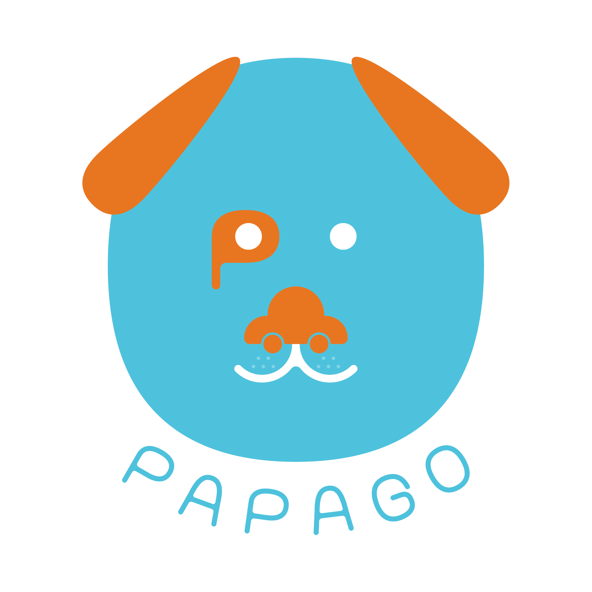
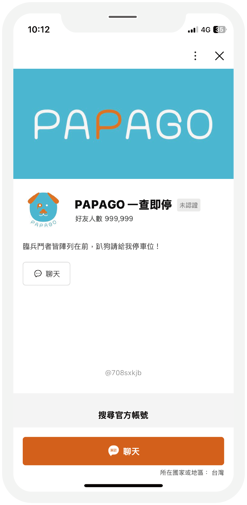
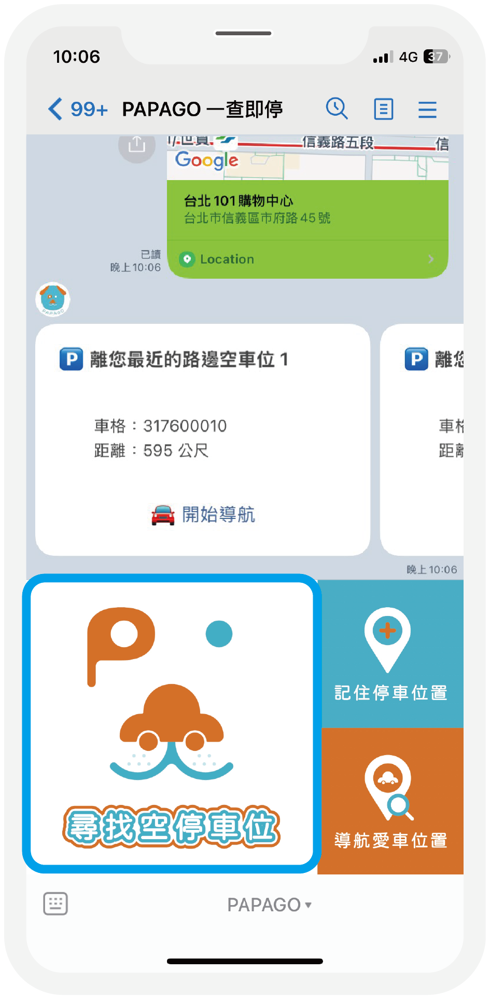
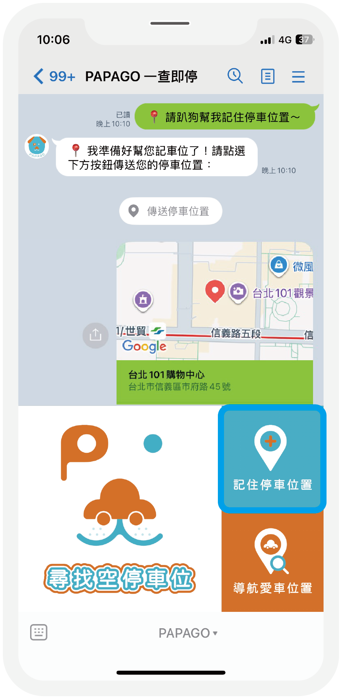
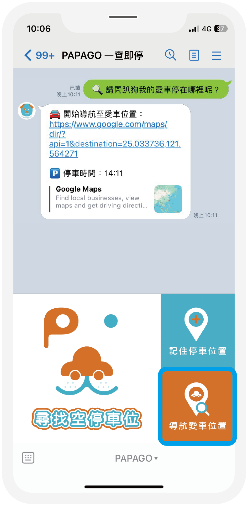

### Line Bot

# PAPAGO 一查即停



<br>

## 發現問題

為了解決雙北地區，停車位一位難求，停車場又貴得嚇人，開發即時尋找路邊空停車位的機器人「趴狗」，成為幫您處理關於停車大小事的好幫手，一按即查！一查即停！

<br>

## 操作說明

| <div align="center">步驟說明</div> | 畫面圖示 |
| :---  | :---: |
| **1. 加入 LINE 好友**<br><br>→ 掃描 QR Code 將「PAPAGO」加入好友<br><br><div align="center"></div> |  |
| **2. 點選「尋找空停車位」**<br><br>→ 分享位置資訊<br>→ 得到離分享位置最近的 3 個路邊空停車位 |  |
| **3. 點選「記住停車位置」**<br><br>→ 傳送停車位置<br>→ 分享位置資訊<br>→ 成功記住位置 |  |
| **4. 點選「導航愛車位置」**<br><br>→ 開始導航至愛車位置 |  |

- #### 目前可使用地區：台北市、新北市

<br>

## 環境變數

建立 .env 檔案並填入金鑰。

```env
# LINE Bot
CHANNEL_ID="your_line_channel_id"
CHANNEL_SECRET="your_line_channel_secret"
CHANNEL_ACCESS_TOKEN="your_line_channel_access_token"

# TDX
TDX_CLIENT_ID="your_tdx_client_id"
TDX_CLIENT_SECRET="your_tdx_client_secret"
```

<br>

## 資料來源

<a href="https://tdx.transportdata.tw/">TDX 運輸資料流通服務</a>

<br>

## 開發者

Zheng Fang

<br>

## 小提醒

### Render 休眠機制

**自動休眠**：若連續 15 分鐘無人使用，伺服器會自動進入休眠狀態。 <br>
**喚醒延遲**：休眠後首位傳送訊息的使用者，需等待約 50 ~ 60 秒。 <br>
**解決方案**：若機器人沒回應，請稍等 1 分鐘後再傳一次。
